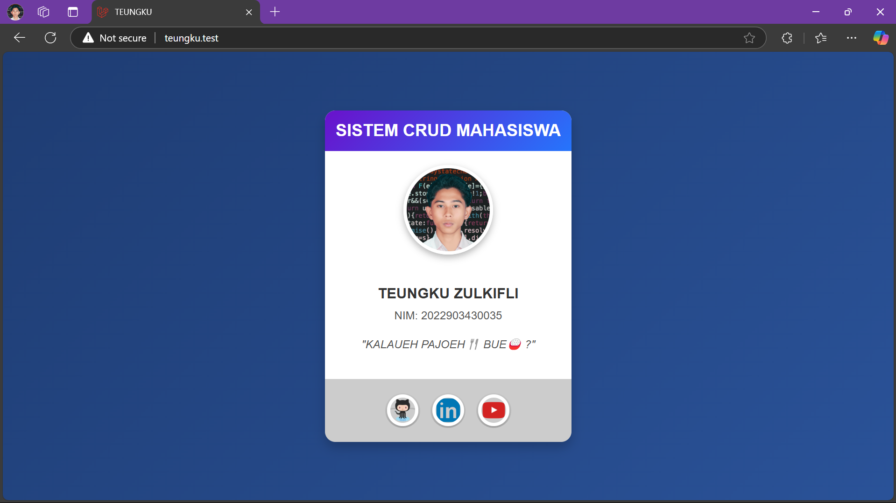

# HAL YANG BISA DI PELAJARI SEBELUM MEMULAI MODUL INI 
# [Getting Started ℹ️](https://github.com/TEUNGKU-ZULKIFLI/installasi-recomended-byTEUNGKU/blob/main/README.md)

# Untuk menambahkan atau mengedit viewnya makin `GACOR` tentunya kita bisa olah tipis".
## Note: Ini merupakan series opsional.
---

## **01.Membuat file home.blade.php dipath `/resources/views`**

### **01.1.Ngoding tipis" di file home.blade.php dipath `/resources/views` dengan code berikut ini:**
```CODINGAN
<!DOCTYPE html>
<html lang="en">
<head>
    <meta charset="UTF-8">
    <meta name="viewport" content="width=device-width, initial-scale=1.0">
    <title>TEUNGKU</title>
    <style>
        * {
        margin: 0;
        padding: 0;
        box-sizing: border-box;
        font-family: Arial, sans-serif;
        }

        body {
        background: linear-gradient(135deg, #1e3c72, #2a5298);
        display: flex;
        justify-content: center;
        align-items: center;
        min-height: 100vh;
        padding: 20px;
        }

        .card {
        background: #fff;
        border-radius: 15px;
        box-shadow: 0 8px 15px rgba(0, 0, 0, 0.2);
        overflow: hidden;
        max-width: 400px;
        text-align: center;
        }

        .card-header {
        background: linear-gradient(135deg, #6a11cb, #2575fc);
        color: #fff;
        padding: 15px;
        font-size: 1.5rem;
        font-weight: bold;
        }

        .card img {
        width: 128px;
        height: 128px;
        border-radius: 100%;
        margin: 20px auto;
        border: 5px solid #fff;
        box-shadow: 0 4px 10px rgba(0, 0, 0, 0.3);
        transition: transform 1s;
        }

        .card img:hover {
        transform: rotateY(180deg);
        transition: transform 1s;
        box-shadow: 0 4px 10px magenta;
        }

        .card-content {
        padding: 20px;
        }

        .card-content h2 {
        margin-bottom: 10px;
        font-size: 1.3rem;
        color: #333;
        }

        .card-content p {
        font-size: 1rem;
        color: #555;
        }

        .card-quote {
        font-style: italic;
        margin: 20px 0;
        color: #000000;
        }

        .card-footer {
        background: whitesmoke;
        padding: 20px 20px;
        display: flex;
        justify-content: center;
        gap: 15px;
        }

        .card-footer .icon {
        width: 50px;
        height: 50px;
        border-radius: 100%;
        overflow: hidden;
        display: flex;
        justify-content: center;
        align-items: center;
        transition: background 0.3s, transform 0.3s;
        }

        .card-footer .icon img {
        width: 45px;
        height: 45px;
        object-fit: cover;
        border-radius: 100%;
        transition: transform 0.3s;
        }

        .card-footer .icon:hover {
        transition: 1s;
        transform: scale(1.2);
        }

        .card-footer .icon:hover img {
        transition: 1s;
        transform: scale(1.3);
        }
    </style>
</head>
<body>
    <div class="card">
        <div class="card-header">
        SISTEM CRUD MAHASISWA
        </div>
        
        <div class="card-content">
        <h2>TEUNGKU ZULKIFLI</h2>
        <p>NIM: 2022903430035</p>
        <p class="card-quote">"KALAUEH PAJOEH🍴 BUE🍚 ?"</p>
        </div>
        <div class="card-footer">
        <a href="https://github.com/TEUNGKU-ZULKIFLI" class="icon" title="GitHub">
            
        </a>
        <a href="https://www.linkedin.com/in/teungku-zulkifli-3953612b7/" class="icon" title="LinkedIn">
            
        </a>
        <a href="https://www.youtube.com/@TEUNGKU-ZULKIFLI" class="icon" title="Youtube">
            
        </a>
        {{-- <a href="https://instagram.com" class="icon" title="Instagram">
            
        </a>
        <a href="https://facebook.com" class="icon" title="Facebook">
            
        </a>
        <a href="https://tiktok.com" class="icon" title="TikTok">
            
        </a> --}}
        </div>
    </div>
</body>
</html>
```

#### **⚠️ALERT⚠️**
PERHATIKAN CODINGAN BERIKUT INI:
```CODINGAN EXAMPLE

```
PASTIKAN NAMA FILENYA ITU BENAR KALAU INI NAMA FILENYA `Teungku.ico`.<br>
DAN JUGA PERHATIKAN CODINGAN BERIKUT INI:
```CODINGAN EXAMPLE
	<a href="https://github.com/TEUNGKU-ZULKIFLI" class="icon" title="GitHub">
            
        </a>
        <a href="https://www.linkedin.com/in/teungku-zulkifli-3953612b7/" class="icon" title="LinkedIn">
            
        </a>
        <a href="https://www.youtube.com/@TEUNGKU-ZULKIFLI" class="icon" title="Youtube">
            
        </a>
```
PASTIKAN DI `href=""` ADALAH LINK SOSMED ANDA.<br>
SERTA DI BAGIAN INI JUGA.
```CODINGAN EXAMPLE
<title>TEUNGKU</title>
```
GANTIKAN MISAL NAMA ANDA.<br>
SERTA INFO LAINNYA
```CODINGAN EXAMPLE
<div class="card-content">
<h2>TEUNGKU ZULKIFLI</h2>
<p>NIM: 2022903430035</p>
<p class="card-quote">"KALAUEH PAJOEH🍴 BUE🍚 ?"</p>
</div>
```
### **01.2.Menambahkan photo di path `/public/` photo-mahasiswa.ico (.jpg/.png/.gif/dll). pastikan Namanya OK👌🏻**

## **02.Mengedit atau menambahkan rute web di file web.php pada path `/routes/` dengan codingan berikut ini:**
```CODINGAN
<?php

use Illuminate\Support\Facades\Route;

// Route::get('/', function () {
//     return view('welcome');
// });

Route::get('/', function () {
    return view('home');
});
```

##  **03.Mengetes dengan mengakses URL `http://nama-mahasiswa.test`**
Dan boom💥 hasilnya.
<div align="center">
  
</div>

# ⚠️BAGI YANG SUDAH MENGUPLOAD PROJECT KE GITHUB⚠️
## **04.Menetapkan perubahan ke repository local.**
### **04.1 git add. menambahkan ke staging area**
PERTAMA ARAHKAN CMD NYA KE PATH FOLDER LARAVEL MISALNYA:<br>
`C:/DEVELOP/MYPROJECT` ATAU `C:/DEVELOP/NAMA_MAHASISWA`
```bash
git add .
```
### **04.2 git commit -m"" mengonfirmasikan perubahan di lokal**
```bash
git commit -m"menambahkan view supaya gak ngantuk😪"
```
## **05.Menetapkan perubahan di repository online.**
```bash
git push
```