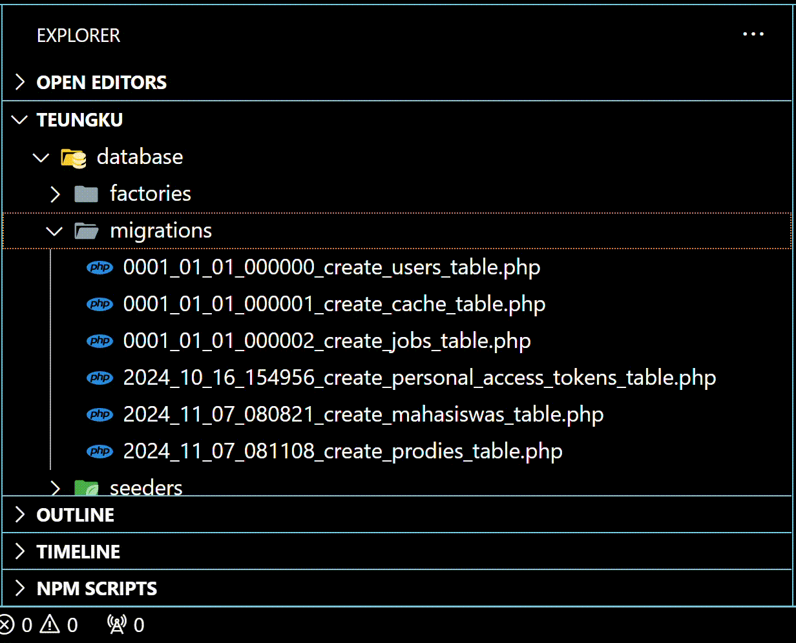

# HAL YANG BISA DI PELAJARI SEBELUM MEMULAI MODUL INI [<kbd>BASIC</kbd>](https://github.com/TEUNGKU-ZULKIFLI/installasi-recomended-byTEUNGKU/blob/ce74a4afdc91ea40aaf2d30cb0fa34342efb4694/README.md)

# Untuk membuat sistem yang seusai login menampilkan data dari yang kita design, entah itu format json dan lainnya, tentu dari table database yang kita buat.
## Note: Ini merupakan series lanjutan dari [<kbd>SISTEM LOGIN AUTH TOKEN](https://github.com/TEUNGKU-ZULKIFLI/installasi-recomended-byTEUNGKU/blob/9ab233a3ddccb27516496447666b41700c385b7f/MEMBUAT%20SISTEM%20LOGIN%20%26%20REGISTER%20LARAVEL%20%26%20JWT.md).
# ⚠️SANGAT DIMOHON MENGIKUTI TAHAPAN SEBELUMNYA⚠️
---

## **01.Membuat table migration dengan perintah php.**

**masuk workspace**
   ```bash
   docker-compose exec workspace bash
   ```

**masuk folder laravel**
   ```bash
   cd nama-folder-laravelnya
   ```

**membuat file mahasiswas.php di database/migrations/**
   ```bash
   php artisan migration
   ```
   ### dengan nama "create_mahasiswas_table"

**membuat file prodies.php di database/migrations/**
   ```bash
   php artisan migration
   ```
  ### dengan nama "create_prodies_table"

## **02.Mengkonfigurasi file migration yang sudah kita buat.**

**buka file mahasiswas.php di path database/migrations/**
```codingan
<?php

use Illuminate\Database\Migrations\Migration;
use Illuminate\Database\Schema\Blueprint;
use Illuminate\Support\Facades\Schema;

return new class extends Migration
{
    /**
     * Run the migrations.
     */
    public function up(): void
    {
        Schema::create('mahasiswas', function (Blueprint $table) {
            $table->id();
            $table->char('nim', 13)->unique();
            $table->string('nama', 100);
            $table->foreignId('prodi_id')->constrained('prodies');
            $table->string('email', 100)->unique();
            $table->string('no_hp', 15)->unique();
            $table->boolean('jenis_kelamin')->default(true); // 1 = Laki-laki, 0 = Perempuan
            $table->string('tempat_lahir', 100);
            $table->date('tanggal_lahir');
            $table->char('golongan_darah', 2)->nullable();
            $table->timestamps();
        });
    }

    /**
     * Reverse the migrations.
     */
    public function down(): void
    {
        Schema::dropIfExists('mahasiswas');
    }
};
```

**buka juga file prodies.php di path database/migrations/**
```codingan
<?php

use Illuminate\Database\Migrations\Migration;
use Illuminate\Database\Schema\Blueprint;
use Illuminate\Support\Facades\Schema;

return new class extends Migration
{
    /**
     * Run the migrations.
     */
    public function up(): void
    {
        Schema::create('prodies', function (Blueprint $table) {
            $table->id();
            $table->string('program_studi', 100);
            $table->timestamps();
        });
    }

    /**
     * Reverse the migrations.
     */
    public function down(): void
    {
        Schema::dropIfExists('prodies');
    }
};
```

**pastikan untuk keberadaan filenya itu prodies.php dulu baru mahasiswas.php**
<div align="center">
  
</div>

**setelah itu save dan run dengan perintah**
```bash
php artisan migrate
```

**melakukan pengecekan apakah sudah dibuat tabelnya ?**
<div align="center">
    
</div>

## **03.Membuat file Models, Controller, Resource dengan perintah php.**

### **03.1.Membuat Models Mahasiswa.php**
```bash
php artisan make:model Mahasiswa
```

### **03.2.Membuat Controller MahasiswaController.php**
```bash
php artisan make:controller Api/Admin/MahasiswaController
```

**Dan coding tipis-tipis dengan code**
```codingan
<?php

namespace App\Http\Controllers\Api\Admin;

use App\Http\Controllers\Controller;
use App\Http\Resources\MahasiswaResource;
use App\Models\Mahasiswa;
use Illuminate\Http\Request;

class MahasiswaController extends Controller
{
    public function index(Request $request)
    {
        $mahasiswas = Mahasiswa::when($request->q, function ($mahasiswas, $request) {
            $mahasiswas = $mahasiswas->where('nama', 'like', '%'. $request->q .'%');
        })->paginate(5);

        return new MahasiswaResource(true, 'List Data Mahasiswa', $mahasiswas);
    }

    public function create()
    {
        //
    }
}
```

### **03.3.Membuat Resource MahasiswaResource.php**

```bash
php artisan make:resource MahasiswaResource
```

**Dan coding tipis-tipis dengan code**
```codingan
<?php

namespace App\Http\Resources;

use Illuminate\Http\Request;
use Illuminate\Http\Resources\Json\JsonResource;

class MahasiswaResource extends JsonResource
{
    public $status;
    public $message;


    public function __construct($status, $message, $resource)
    {
        parent::__construct($resource);
        $this->status = $status;
        $this->message = $message;

    }

    /**
     * Transform the resource into an array.
     *
     * @return array<string, mixed>
     */
    public function toArray(Request $request): array
    {
        return [
            'success'   => $this->status,
            'message'   => $this->message,
            'data'      => $this->resource
        ];
    }
}
```

## **04.Membuat file seeder dan Menambahkan data (isian data pada pertabelnya nanti).**

### **04.1.Membuat file Mahasiswa Seeder dengan php**

```bash
php artisan make:seeder MahasiswaSeeder
```

**Dan coding tipis-tipis dengan code**
```codingan
<?php

namespace Database\Seeders;

use GuzzleHttp\Promise\Create;
use Illuminate\Database\Console\Seeds\WithoutModelEvents;
use Illuminate\Database\Seeder;
use Illuminate\Support\Facades\DB;

class MahasiswaSeeder extends Seeder
{
    /**
     * Run the database seeds.
     */
    public function run(): void
    {
        DB::table('mahasiswas')->insert([
            [
                'nim' => '2022903430035',
                'nama' => 'TEUNGKU ZULKIFLI',
                'prodi_id' => 2,
                'email' => 'teungkuzulkifli08@gmail.com',
                'no_hp' => '083105851202',
                'jenis_kelamin' => 1,
                'tempat_lahir' => 'PIDIE JAYA',
                'tanggal_lahir' => '2004-12-20',
                'golongan_darah' => 'O',
                'created_at' => now()
            ],
        ]);
    }
}
```

### **04.2.Membuat file Prodi Seeder dengan php**

```bash
php artisan make:seeder ProdiSeeder
```

**Dan coding tipis-tipis dengan code**
```codingan
<?php

namespace Database\Seeders;

use Illuminate\Database\Console\Seeds\WithoutModelEvents;
use Illuminate\Database\Seeder;
use Illuminate\Support\Facades\DB;

class ProdiSeeder extends Seeder
{
    /**
     * Run the database seeds.
     */
    public function run(): void
    {
        DB::table('prodies')->insert([
            ['program_studi' => 'Teknik Informatika'],
            ['program_studi' => 'Teknologi Rekayasa Komputer Jaringan'],
            ['program_studi' => 'Teknologi Rekayasa Multimedia'],
            ['program_studi' => 'Teknologi Rekayasa Perangkat Lunak'],
        ]);
    }
}
```

### **04.3.Mengedit file DatabaseSeeder.php supaya gak ribet dan bentrokan pas pengisian datanya**

**buka file \database\seeders\DatabaseSeeder.php dan tambahin / edit.**
```codingan
<?php

namespace Database\Seeders;

use App\Models\User;
// use Illuminate\Database\Console\Seeds\WithoutModelEvents;
use Illuminate\Database\Seeder;

class DatabaseSeeder extends Seeder
{
    /**
     * Seed the application's database.
     */
    public function run(): void
    {
        // User::factory(10)->create();

        $this->call([
            UserSeeder::class,
            ProdiSeeder::class,
            MahasiswaSeeder::class,
        ]);
    }
}
```

## **05.Mengatur rute untuk nantinya kita bisa test di platform POSTMAN**

**buka file \routes\api.php dan menambahkan rutenya.**
```codingan
<?php

use Illuminate\Http\Request;
use Illuminate\Support\Facades\Route;
use App\Http\Controllers\Api\Admin\LoginController;

Route::prefix('admin')->group(function () {
    Route::post('/login', [LoginController::class, 'index'])->name('admin.login');

    Route::group(['middleware' => 'auth:api_admin'], function () {
        Route::get('/user', [LoginController::class, 'getUser'])->name('admin.user');
        Route::get('/refresh', [LoginController::class, 'refreshToken'])->name('admin.refresh');
        Route::post('/logout', [LoginController::class, 'logout'])->name('admin.logout');

        Route::apiResource('/mahasiswa', App\Http\Controllers\Api\Admin\MahasiswaController::class, ['except' => ['create', 'edit'], 'as' => 'admin']);
    });
});
```

## **06.Merunningnya dengan perintah php**

**Setelah semua dan sekian lamanya, disave dan di ini itukan ya sekarang kita run kan dengan mengetik di bash root**
```bash
php artisan db:seed
```

## **07.Menguji dengan POSTMAN**
[](https://youtu.be/rTizqxYB2e8)
